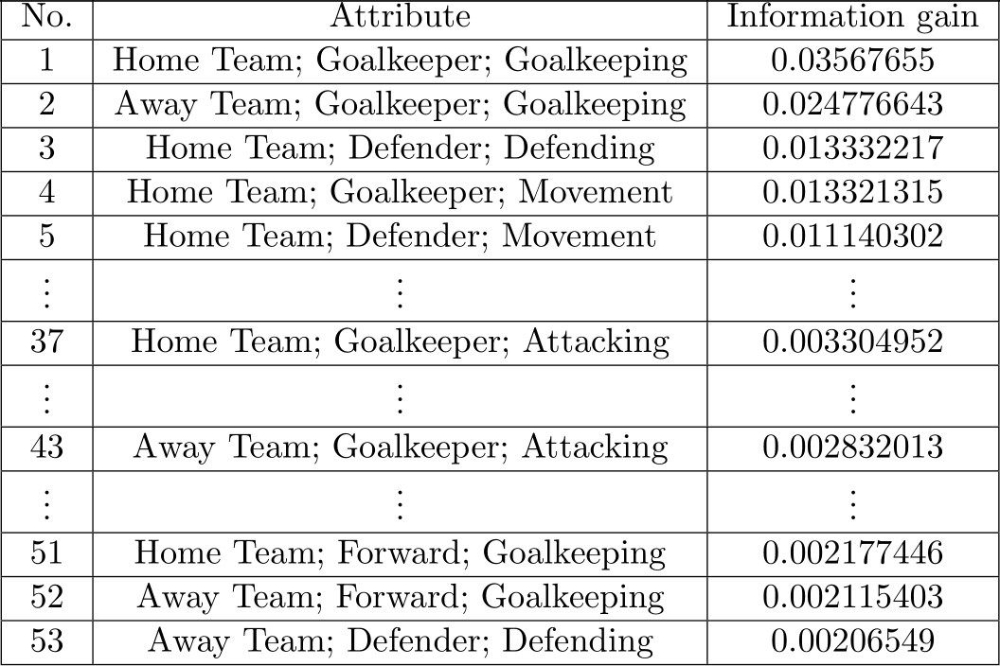

(Jimmy) Hyun Jin Kim <hyunkim2015@u.northwestern.edu>  
Jeremy Rath <JeremyRath2020@u.northwestern.edu>  
EECS 349 Machine Learning  
Northwestern University

[Repository for codes and data](https://github.com/TheLordBlarg/Soccer_Success)  
[Detailed report](https://github.com/TheLordBlarg/Soccer_Success/raw/master/report/project_report.pdf)

# Motivation

Predicting the outcome of sports matches is one of the favorite topics for statisticians and
gamblers alike. It is an interesting problem where the question of the respective importance of
randomness (’luck’) and determinism (’skill’) is hotly debated. Of course, much importance also
lies in the fact that successful predictions can lead to lots of money. For soccer, previous prediction
methods mostly used team-level features while neglecting individual skills. We hypothesize
that individual skills are crucial to soccer and contain much information for predicting match
outcomes which those other methods are not utilizing. Therefore, in this project, we sought to
develop a machine learning strategy that predicts the outcomes of soccer matches based mainly
on the individual attributes of the players on each team.

# Approach

Our novel approach uses as features the in-game stats from the Electronic Arts' celebrated game franchise FIFA, which were [painstakingly crafted by the experts](http://www.espnfc.us/blog/espn-fc-united-blog/68/post/2959703/fifa-17-player-ratings-system-blends-advanced-stats-and-subjective-scouting). Those numerical stats (1-100) measuring skills falling under broad categories (attacking, skill, movement, power, mentality, defending, and goalkeeping. For practical reasons, we averaged over different positions in the team (forward, midfielder, defender, goalkeeper) all the skills falling under those categories. This was then combined with the records of matches to yield a dataset consisting of match outcomes (home team win, loss, or draw) and stats. For training the classification model, we used both Weka (specific algorithms shown in the next section) and our custom-made single hidden layer neural network with softmax output units. To investigate which features are the most important, we also wrote a program to calculate the maximum information gain that can be obtained by making a split (in the manner of decision trees) along each variable.

# Results

Figure 1 shows the results of various Weka algorithms applied to the dataset. Logistic regression, which performed the best, only yielded a 3% improvement over the baseline.

*Figure 1. Results from select algorithms in Weka. The models were trained on 2104 Premier League matches played in 2010-2017 excluding the 2015-2016 season. 273 matches played in the 2015-2016 season were set aside as the test set.*

Our custom single hidden layer neural network implementation was no more successful. Figure 2 shows the learning curve of the network with 30 hidden units. It is clear that there is underfitting and the model is incapable of capturing the underlying trend of the data. Same results were obtained for hidden layer size ranging from 10-100 units.

*Figure 2. Typical learning curve for custom-made single layer neural network*

Figure 3 shows the list of select features and the corresponding amount of information. It appears that goalkeeping and defending are the most important factors in deciding the outcome of a soccer match. However, one should be wary about making such conclusions as there are also nonsensical results such as the goalkeeper's attacking or the forward's goalkeeping skills yielding more information than defender's defending skills.

*Figure 3. List of select features ordered by their information gain. Full list available [in the repository](https://github.com/TheLordBlarg/Soccer_Success/blob/master/results/entropy_train.csv)*
